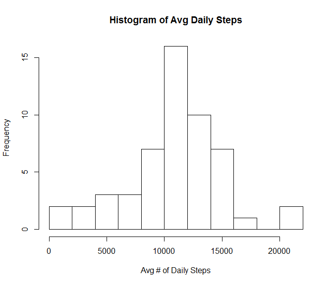
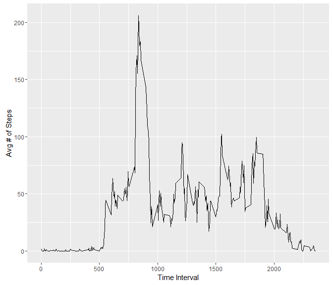
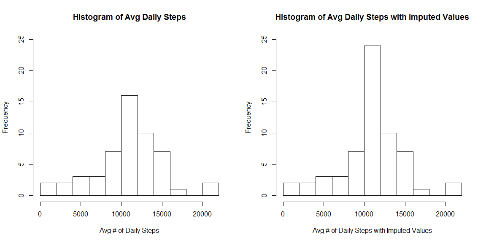
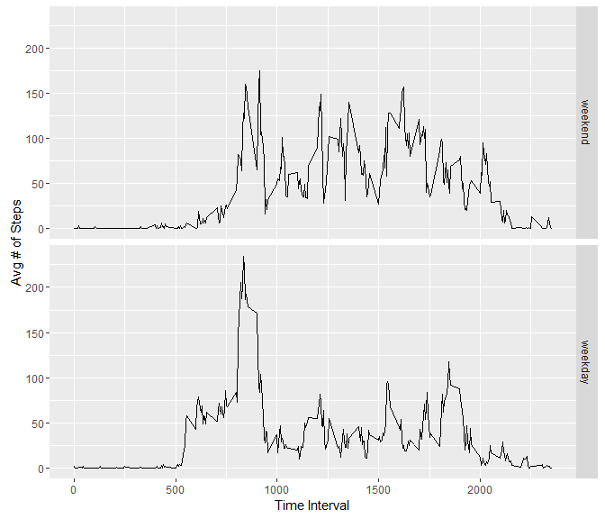

# Reproducible Research: Peer Assessment 1


## Loading and preprocessing the data


```r
unzip("activity.zip")
activity_raw=read.csv("activity.csv")
activity = activity_raw[!is.na(activity_raw$steps),]
```


## What is mean total number of steps taken per day?

### Calculate total number of steps per taken each day:


```r
dailySteps = group_by(activity, date) %>% 
    summarize(sumSteps=sum(steps))
```

### Histogram of the total number of steps taken each day


```r
hist(dailySteps$sumSteps, breaks=15, 
     xlab = "Avg # of Daily Steps", 
     main="Histogram of Avg Daily Steps")
```



### Mean and Median of the total number of steps taken per day


```r
dailyStepsSummary = summary(dailySteps$sumSteps)
medianDailySteps = as.numeric(dailyStepsSummary["Median"])
meanDailySteps = as.numeric(dailyStepsSummary["Mean"])
```

* **Mean of Total # of Steps/Day:      10770**
* **Median of Total # of Steps/Day:      10760**


## What is the average daily activity pattern?

### Time series plot of the 5-minute interval (x-axis) and the average number of steps taken, averaged across all days (y-axis)


```r
intervalMeanSteps = group_by(activity, interval) %>% summarize(avgStepsAcrossDays=mean(steps))
ggplot(intervalMeanSteps, aes(interval, avgStepsAcrossDays)) + 
    geom_line() + xlab("Time Interval") + ylab("Avg # of Steps")
```



### The 5-minute interval, on average across all the days in the dataset, that contains the maximum number of steps?


```r
maxSteps = max(intervalMeanSteps$avgStepsAcrossDays)
maxIntervalRow = intervalMeanSteps[intervalMeanSteps$avgStepsAcrossDays == maxSteps,];
intervalOfMaxSteps = maxIntervalRow$interval
```

* **Interval with maximum number of steps: 835**


## Imputing missing values

### Total number of missing values in the dataset (i.e. the total number of rows with NAs)


```r
totalNAStepsEntries = sum(is.na(activity_raw$steps))
```

* **Number of missing values in dataset: 2304**

### Fill in missing data with mean value for interval across all days


```r
naToMean = function(x) replace(x, is.na(x), mean(x,na.rm=TRUE))
activityClean = ddply(activity_raw, ~ interval, transform, steps=naToMean(steps))
```

### Compare original histogram with imputed dataset histogram

Histogram of the total number of steps taken each day and calculate 


```r
dailyStepsClean = group_by(activityClean, date) %>% summarize(sumSteps=sum(steps))

par(mfrow = c(1,2))
hist(dailySteps$sumSteps, breaks=15, 
     xlab = "Avg # of Daily Steps", 
     ylim = range(0:25),
     main="Histogram of Avg Daily Steps")

hist(dailyStepsClean$sumSteps, breaks=15,
     xlab = "Avg # of Daily Steps with Imputed Values", 
     ylim = range(0:25),
     main="Histogram of Avg Daily Steps with Imputed Values")
```



The mean and median total number of steps taken per day. 


```r
dailyStepsCleanSummary = summary(dailyStepsClean$sumSteps)
medianDailyStepsClean = as.numeric(dailyStepsCleanSummary['Median'])
meanDailyStepsClean = as.numeric(dailyStepsCleanSummary['Mean'])
medianDiff = medianDailySteps - medianDailyStepsClean
meanDiff = meanDailySteps - meanDailyStepsClean
```

* **Imputed Dataset's Mean of Total # of Steps/Day:      10770**
* **Imputed Dataset's Median of Total # of Steps/Day:      10770**

### Do these values differ from the estimates from the first part of the assignment? 

Imputed data set has more values in the cetner column, which is expected since we use the mean to fill in missing data.

### What is the impact of imputing missing data on the estimates of the total daily number of steps?

* Different between means: **0**
* Difference between medians: **-10**

The mean stays the same since we imputed with mean. 
The median has shifted due to the new imputed values introduced


## Are there differences in activity patterns between weekdays and weekends?

### Create a new factor variable in the dataset with two levels: weekday/weekend indicating whether a given date is a weekday or weekend day.


```r
weekdaysNames <- c('Monday', 'Tuesday', 'Wednesday', 'Thursday', 'Friday')
activity$date = as.Date(activity$date)
activityWithDayType=mutate(activity, 
                           day=weekdays(date), 
                           dayType=factor((weekdays(date) %in% weekdaysNames), labels=c('weekend','weekday')))
```

### Panel plot of time series plot of the 5-minute interval (x-axis) and the average number of steps taken, averaged across all weekday days or weekend days (y-axis).


```r
intervalDayTypeMeanSteps = group_by(activityWithDayType, interval, dayType) %>% summarize(avgStepsAcrossDays=mean(steps))
ggplot(intervalDayTypeMeanSteps, aes(interval, avgStepsAcrossDays)) + 
    geom_line() + xlab("Time Interval") + ylab("Avg # of Steps") + facet_grid(dayType ~ .)
```


